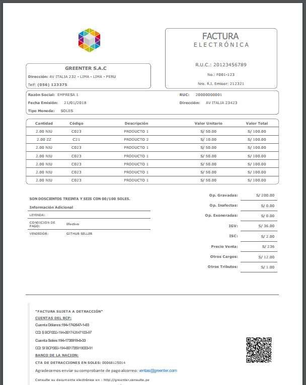

# Html to PDF Report - Greenter

[](https://github.com/thegreenter/greenter)
  
Greenter HTML Report a PDF usando [wkhtmltopdf](https://wkhtmltopdf.org/).
> Para generar el HTML utilizar [greenter/report](https://github.com/thegreenter/report).

## Instalar
Usar composer desde [packagist](https://packagist.org/packages/greenter/htmltopdf).
```bash
composer require greenter/htmltopdf
```
## Requirements
- [Wkhtmltopdf](https://wkhtmltopdf.org/) executable.
- [exec() function](http://php.net/manual/en/function.exec.php) enabled.

## Example
Require [html-report](https://github.com/thegreenter/report) and logo.png

```php
use Greenter\Report\HtmlReport;
use Greenter\Report\PdfReport;
use Greenter\Model\Sale\Invoice;

$invoice = new Invoice();
// fill ...

$html = new HtmlReport('', [
    'cache' => __DIR__ . '/cache',
    'strict_variables' => true,
]);
$html->setTemplate('invoice.html.twig');

$report = new PdfReport($html);
$report->setOptions( [
    'no-outline',
    'viewport-size' => '1280x1024',
    'page-width' => '21cm',
    'page-height' => '29.7cm',
]);
$report->setBinPath('wkhtmltopdf.exe');

$logo = file_get_contents(__DIR__.'/logo.png');
$params = [
    'system' => [
        'logo' => $logo,
        'hash' => ''
    ],
    'user' => [
        'resolucion' => '212321',
        'header'     => 'Telf: <b>(056) 123375</b>',
        'extras'     => [
            ['name' => 'CONDICION DE PAGO', 'value' => 'Efectivo'     ],
            ['name' => 'VENDEDOR'         , 'value' => 'GITHUB SELLER'],
        ],
    ]
];

$pdf = $report->render($invoice, $params);

// Write PDF to disk
file_put_contents('invoice.pdf', $pdf);

```

## Preview
Representacion Impresa de una Factura Electrónica.



