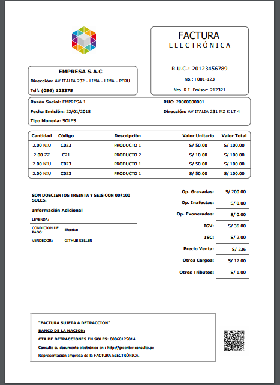

# HTML Report - Greenter
[](https://www.codacy.com/app/giansalex/greenter-report?utm_source=github.com&utm_medium=referral&utm_content=giansalex/greenter-report&utm_campaign=badger)
[](https://travis-ci.org/giansalex/greenter-report)
[](https://scrutinizer-ci.com/g/giansalex/greenter-report/?branch=master)
[](https://scrutinizer-ci.com/g/giansalex/greenter-report/?branch=master)
[](https://scrutinizer-ci.com/g/giansalex/greenter-report/build-status/master)  

Representación en formato HTML del comprobante electrónico empleado en la facturación electrónica - SUNAT - Perú.
> Para generar el PDF puede utilizar [wkhtmltopdf](https://wkhtmltopdf.org/) y/o [greenter/htmltopdf](https://github.com/giansalex/greenter-htmltopdf).

## Install
Via Composer desde [packagist.org](https://packagist.org/packages/greenter/report)
```bash
composer require greenter/report
```

## Example
```php
$invoice = new Invoice();
// $invoice->set...

$report = new HtmlReport();

$report->setTemplate('invoice.html.twig');

$html = $report->render($invoice, [
    'system' => [
        'logo' => $logo,
        'hash' => 'qqnr2dN4p/HmaEA/CJuVGo7dv5g=',
    ],
    'user' => [
        'header' => 'Telf: <b>(056) 123375</b>',
        'resolucion' => '212321',
    ]
]);

echo $html;
```

## Preview



## Documents
- [x] Factura Electrónica  
- [x] Boleta Electrónica  
- [x] Nota de Crédito Electrónica  
- [x] Nota de Débito Electrónica  
- [x] Guía de Remisión Electrónica  
- [x] Retención Electrónica  
- [x] Percepción Electrónica
- [x] Resumen diario de Boletas
- [x] Comunicación de Bajas
- [x] Resumen diario de Reversiones

## Features
- Generación de Codigo QR
- Logo (PNG, JPEG, GIF)
- Obteneción del Hash de la firma digital
- Agregar cabecera y pie de pagina personalizado
- Agregar datos extras al comprobante
- Crear nuevas plantillas según sus propios requerimientos
